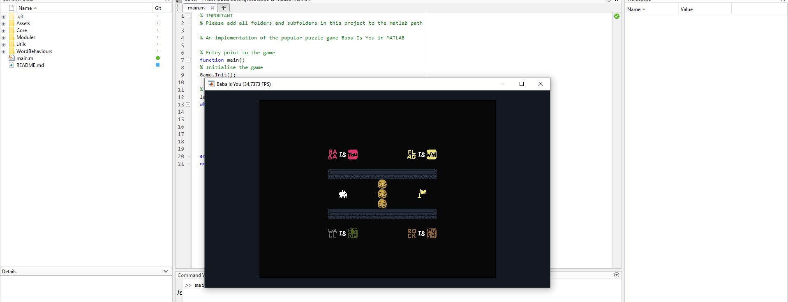

# baba-is-matlab

An implementation of Baba Is You in MATLAB.

## Features
- 10 levels
- Full sentence parsing
- Matrices

## How to run
### Prerequisites:
- Recent version of MATLAB
- [Baba is You](https://hempuli.com/baba)

### Preparing to run
1. Before opening in MATLAB, navigate to the `Assets` folder and run `python generate_atlas.py <Path to Baba Is You Data folder>` to generate the sprite atlas. (You need to have the game installed)
2. After opening in MATLAB, add the `Assets`, `Core`, `Modules`, `Utils` and `WordBehaviours` folders and their subfolder to the MATLAB path.
3. Run `main.m`.

### How to play:
- Arrow keys/WASD to input directions
- Space to wait
- R to restart the level
- = to skip level
